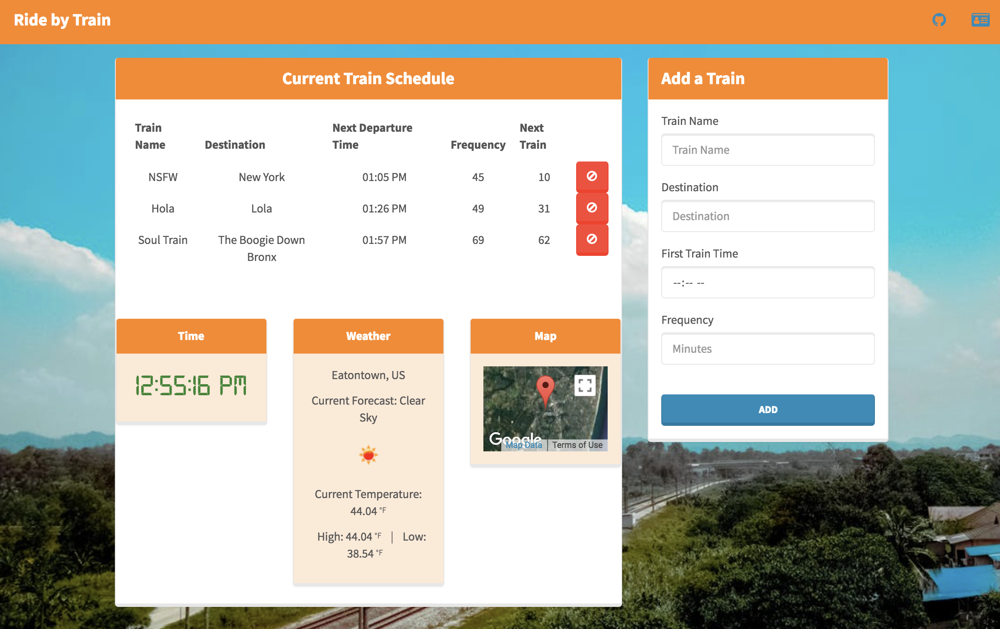

# Ride-by-Train
Ride-by-Train - A train scheduling application that lets users create, edit,and save train schedules.

**Live Demo**: https://wrainaud.github.io/Ride-by-Train/



Table of Contents
-------

- [Getting Started](#getting-started)
- [Technologies](#technologies)
- [Obtaining API Keys](#obtaining-api-keys)
- [Project Structure](#project-structure)
- [Support](#support)
- [Contributing](#contributing)
- [License](#license)

Getting Started
---------------

The easiest way to get started is to clone the repository:

```bash
# Get the latest snapshot
git clone --depth=1 https://github.com/wrainaud/Ride-by-Train.git myproject

# Change directory
cd myproject

# Create Config file to hook into Firebase
touch config.js 
```
Technologies
-------

- HTML5
- CSS3
    - Bootstrap
    - Bootswatch
    - FontAwesome
- Javascript
- jQuery
- Moment.js
- AJAX
- Database
    - Firebase
- APIs
    - GoogleMaps API
    - OpenWeatherMap API

Obtaining API Keys
-------


- Visit <a href="https://openweathermap.org/api" target="_blank">Open Weather Map</a>
- Sign up for an account <a href="http://home.openweathermap.org/users/sign_up" target="_blank"> Here </a>
- Once you have your API Key, add this line to the `config.js` file: `OW_API_Key: '{API KEY GOES HERE}'`
<hr>


- Visit <a href="https://console.firebase.google.com" target="_blank">Firebase Console</a>
- Click on the **Create Project** button
- Enter *Project Name*, then click on **Create** button
- Then click on *APIs & auth* in the sidebar and select *API* tab
- Click on **Google+ API** under *Social APIs*, then click **Enable API**
- Next, under *APIs & auth* in the sidebar click on *Credentials* tab
- Click on **Create new Client ID** button
- Select *Web Application* and click on **Configure Consent Screen**
- Fill out the required fields then click on **Save**
- In the *Create Client ID* modal dialog:
 - **Application Type**: Web Application
 - **Authorized Javascript origins**: http://localhost:3000
 - **Authorized redirect URI**: http://localhost:3000/auth/google/callback
- Click on **Create Client ID** button
- After the API's are hooked up, go back to <a href="https://console.firebase.google.com" target="_blank">Firebase Console</a>
- Select the project you created and click the **Add Firebase to your web app** button
- Copy and paste *var Config {...};* into `config.js` file

**Note:** When you ready to deploy to production don't forget to
add your new url to *Authorized Javascript origins* and *Authorized redirect URI*,
e.g. `http://my-awesome-app.herokuapp.com` and

`http://my-awesome-app.herokuapp.com/auth/google/callback` respectively.
The same goes for other providers.
<hr>


Project Structure
-------
```
|-- assets/
|  |-- css/
|     |-- digital-7.ttf                 // Imported Font 
|     |-- style.css                     // Local CSS Styles
|  |-- images/                             
|  |-- js/                             
|     |-- app.js                    // Configures the connection to the database / Methods for Adding / Removing Trains
|     |-- weather.js                // Methods for getting and setting the weather from Open Weather API
| 
| -- index.html                     // Main HTML page with structure
```

Support
-------

Please [open an issue](https://github.com/wrainaud/Ride-by-Train/issues/new) for support.

Contributing
-------

Please contribute using [Github Flow](https://guides.github.com/introduction/flow/). Create a branch, add commits, and [open a pull request](https://github.com/wrainaud/Ride-by-Train/compare/).

License
-------

The MIT License (MIT)

Copyright (c) 2017-2018 William J. Rainaud

Permission is hereby granted, free of charge, to any person obtaining a copy of this software and associated documentation files (the "Software"), to deal in the Software without restriction, including without limitation the rights to use, copy, modify, merge, publish, distribute, sublicense, and/or sell copies of the Software, and to permit persons to whom the Software is furnished to do so, subject to the following conditions:

The above copyright notice and this permission notice shall be included in all copies or substantial portions of the Software.

THE SOFTWARE IS PROVIDED "AS IS", WITHOUT WARRANTY OF ANY KIND, EXPRESS OR IMPLIED, INCLUDING BUT NOT LIMITED TO THE WARRANTIES OF MERCHANTABILITY, FITNESS FOR A PARTICULAR PURPOSE AND NONINFRINGEMENT. IN NO EVENT SHALL THE AUTHORS OR COPYRIGHT HOLDERS BE LIABLE FOR ANY CLAIM, DAMAGES OR OTHER LIABILITY, WHETHER IN AN ACTION OF CONTRACT, TORT OR OTHERWISE, ARISING FROM, OUT OF OR IN CONNECTION WITH THE SOFTWARE OR THE USE OR OTHER DEALINGS IN THE SOFTWARE.  
